## 
                        Colored Shadows Documentation

## What is it

ColoredShadows is a library to be used together with shadergraph to easily create customized shadows inside of Unity URP.

## Guides

### Setup

After you have imported the core library go to your Universal Render Pipeline Asset (in a new project located under “Settings/PC_RPAsset”). Click on the plus icon on the renderer list located at the top and add the ColoredShadow URD asset.

>>>>>  gd2md-html alert: inline image link here (to images/image1.png). Store image on your image server and adjust path/filename/extension if necessary.  (<a href="#">Back to top</a>)(<a href="#gdcalert2">Next alert</a>) >>>>> 

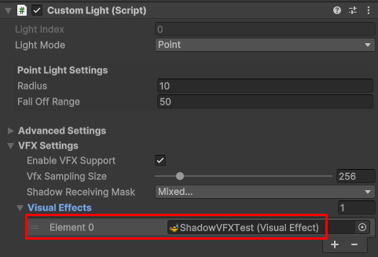

>>>>>  gd2md-html alert: inline image link here (to images/image2.png). Store image on your image server and adjust path/filename/extension if necessary.  (<a href="#">Back to top</a>)(<a href="#gdcalert3">Next alert</a>) >>>>> 

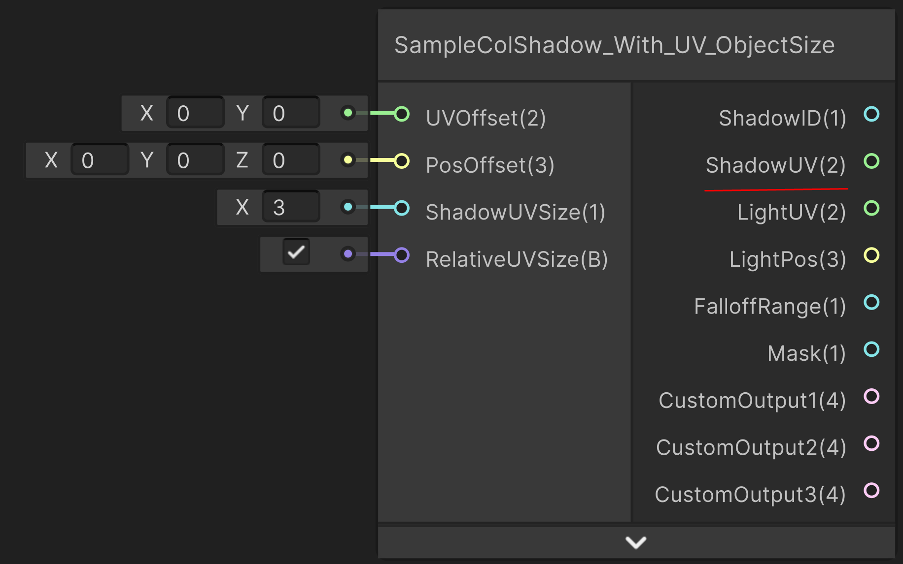

To test if it works, open the SampleColShadowScene in the sample folder.

### Making a custom shadow

Set the _ShadowID on the object casting a shadow to something above 1 (preferably whole numbers).

>>>>>  gd2md-html alert: inline image link here (to images/image3.png). Store image on your image server and adjust path/filename/extension if necessary.  (<a href="#">Back to top</a>)(<a href="#gdcalert4">Next alert</a>) >>>>> 

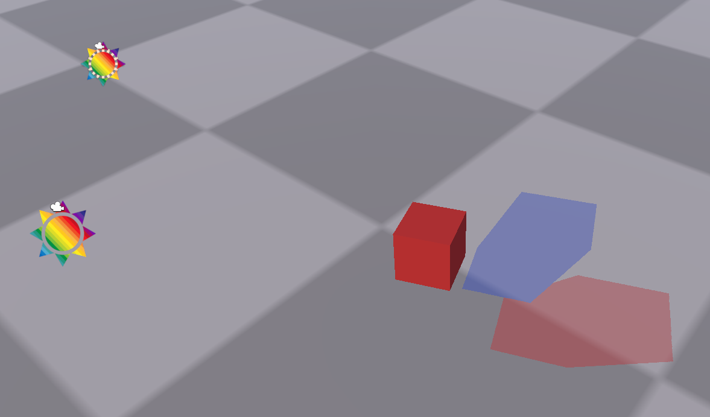

Make a new shader for the floor and add the “SampleColShadow_With_UV_ObjectSize” to the shadergraph. And connect the ShadowID value to the color. The _ShadowID value you set on the cube is the ShadowID value you get from the SampleColShadow shader graph node in the floor shader.

>>>>>  gd2md-html alert: inline image link here (to images/image4.png). Store image on your image server and adjust path/filename/extension if necessary.  (<a href="#">Back to top</a>)(<a href="#gdcalert5">Next alert</a>) >>>>> 

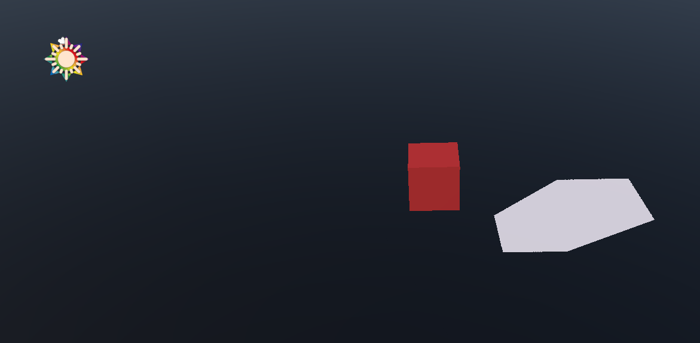

After having set the ShadowID to the base color you should now see something like this. If you set the _ShadowID on the cube to 0.5 you should see the shadow gets darker and if you set it to 1 it should be fully white.

>>>>>  gd2md-html alert: inline image link here (to images/image5.png). Store image on your image server and adjust path/filename/extension if necessary.  (<a href="#">Back to top</a>)(<a href="#gdcalert6">Next alert</a>) >>>>> 

Now add a second cube and give it a copy of the material of the cube and give it a _ShadowID of 2.

>>>>>  gd2md-html alert: inline image link here (to images/image6.png). Store image on your image server and adjust path/filename/extension if necessary.  (<a href="#">Back to top</a>)(<a href="#gdcalert7">Next alert</a>) >>>>> 

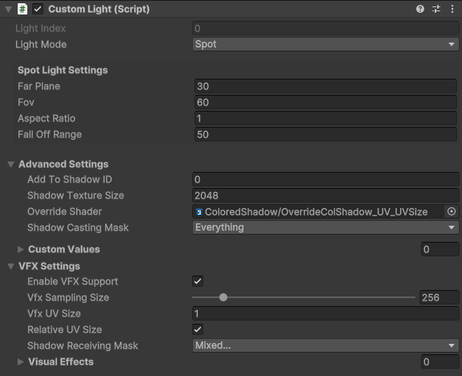

To give both cubes a differently colored shadow we use the _ShadowID set on the cube as a mask to differentiate between the two shadows. We check if the ShadowID given to use by the SampleColShadow node matches with our ShadowID values set on the cubes. We use a comparison node to give us a mask that is 1 for the object's shadow that has a matching ShadowID. Then we multiply it with whatever color we want.

>>>>>  gd2md-html alert: inline image link here (to images/image7.png). Store image on your image server and adjust path/filename/extension if necessary.  (<a href="#">Back to top</a>)(<a href="#gdcalert8">Next alert</a>) >>>>> 

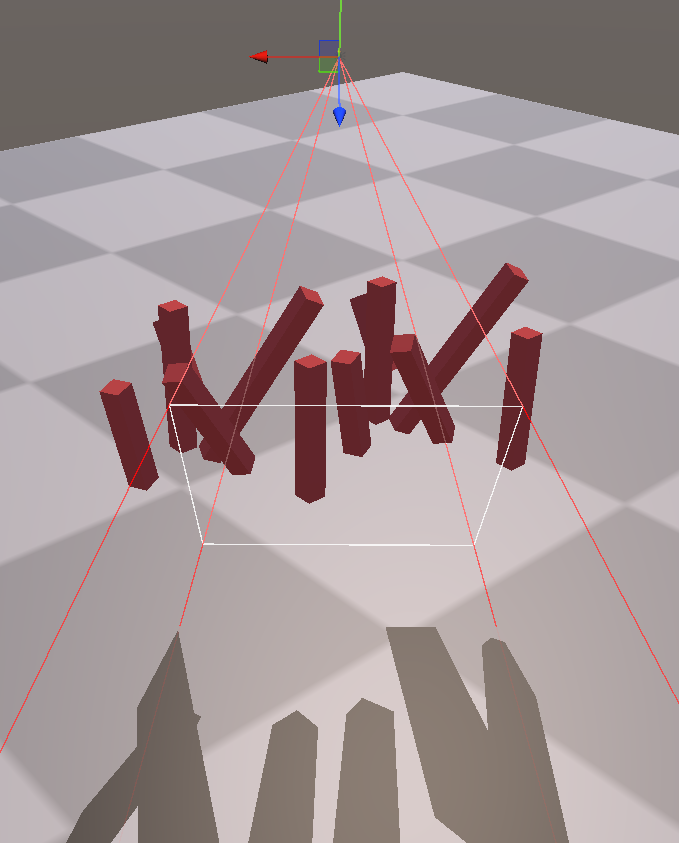

You should now see something like this if you set _ShadowID values on the cube to a 1 and a 2.

>>>>>  gd2md-html alert: inline image link here (to images/image8.png). Store image on your image server and adjust path/filename/extension if necessary.  (<a href="#">Back to top</a>)(<a href="#gdcalert9">Next alert</a>) >>>>> 

To set the color for the rest of the material we use the mask value given to us from the SampleColShadow node and a lerp. The mask value is a 1 everywhere a shadow is and 0 where there is none. We use a lerp where in the A slot is our generic floor texture, in the B slot is our custom shadow, and in the T is our mask which we use to blend the 2 together. We can also multiply the mask with for example 0.5 to get a softer blend between the floor and shadows.

>>>>>  gd2md-html alert: inline image link here (to images/image9.png). Store image on your image server and adjust path/filename/extension if necessary.  (<a href="#">Back to top</a>)(<a href="#gdcalert10">Next alert</a>) >>>>> 

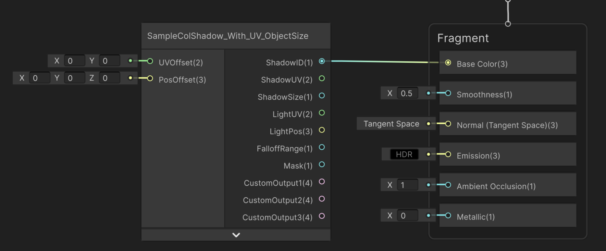

We should now see our floor texture blended with our custom shadows.

>>>>>  gd2md-html alert: inline image link here (to images/image10.png). Store image on your image server and adjust path/filename/extension if necessary.  (<a href="#">Back to top</a>)(<a href="#gdcalert11">Next alert</a>) >>>>> 

### Adding an animated offset

To add an animated offset we use the UVOffset or PosOffset on the SampleColShadow shader node in the floor shader.

>>>>>  gd2md-html alert: inline image link here (to images/image11.png). Store image on your image server and adjust path/filename/extension if necessary.  (<a href="#">Back to top</a>)(<a href="#gdcalert12">Next alert</a>) >>>>> 

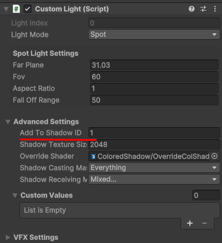

For this example I used the PosOffset and created a simple scrolling noise texture that I plugged into the PosOffset. You should see your shadows now moving in waves across the floor. To learn the nuances between UVOffset and PosOffset refer to the documentation.

>>>>>  gd2md-html alert: inline image link here (to images/image12.png). Store image on your image server and adjust path/filename/extension if necessary.  (<a href="#">Back to top</a>)(<a href="#gdcalert13">Next alert</a>) >>>>> 

The result

>>>>>  gd2md-html alert: inline image link here (to images/image13.png). Store image on your image server and adjust path/filename/extension if necessary.  (<a href="#">Back to top</a>)(<a href="#gdcalert14">Next alert</a>) >>>>> 

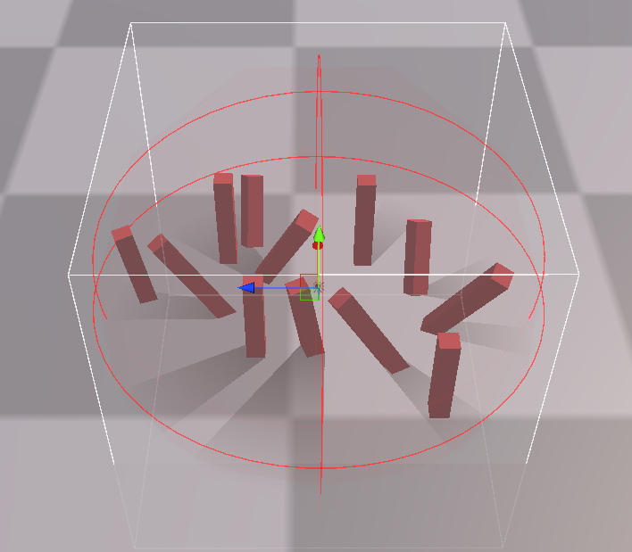

### Adding textures to shadows

We start by adding a ShadowUV node and plugging ShadowUV, ShadowSize, LightUV into the ShadowUV like the example below.

>>>>>  gd2md-html alert: inline image link here (to images/image14.png). Store image on your image server and adjust path/filename/extension if necessary.  (<a href="#">Back to top</a>)(<a href="#gdcalert15">Next alert</a>) >>>>> 

Then we plug the generated UV’s into a texture sample node and plug that into our mask.

>>>>>  gd2md-html alert: inline image link here (to images/image15.png). Store image on your image server and adjust path/filename/extension if necessary.  (<a href="#">Back to top</a>)(<a href="#gdcalert16">Next alert</a>) >>>>> 

Our texture is mapped but the uv size is incorrect so our texture gets repeated. To fix this we need to change the ShadowUVMultiplier variable on the ShadowUV node.

>>>>>  gd2md-html alert: inline image link here (to images/image16.png). Store image on your image server and adjust path/filename/extension if necessary.  (<a href="#">Back to top</a>)(<a href="#gdcalert17">Next alert</a>) >>>>> 

After having set the ShadowUVMultiplier value to 3 and adding a sampler set to clamp on the texture sample node we get our desired result.

>>>>>  gd2md-html alert: inline image link here (to images/image17.png). Store image on your image server and adjust path/filename/extension if necessary.  (<a href="#">Back to top</a>)(<a href="#gdcalert18">Next alert</a>) >>>>> 

### Multiple different shadows per object

We start with 2 custom lights both casting a shadow on the cube.

>>>>>  gd2md-html alert: inline image link here (to images/image18.png). Store image on your image server and adjust path/filename/extension if necessary.  (<a href="#">Back to top</a>)(<a href="#gdcalert19">Next alert</a>) >>>>> 

We set the “Add To Shadow ID” on the custom light component to 1.

>>>>>  gd2md-html alert: inline image link here (to images/image19.png). Store image on your image server and adjust path/filename/extension if necessary.  (<a href="#">Back to top</a>)(<a href="#gdcalert20">Next alert</a>) >>>>> 

The ShadowID from the SampleColShadow node in the floor shader is the _ShadowID from the cube plus the “AddToShadowID” value from the custom light. So because we set the cube _ShadowID to 1 and the “AddToShadowID” to 1 our ShadowID in the floor shader is 2 (because they both get added to each other 1 + 1 = 2). And this is what our final shader looks like. The shadow cast from the custom light with an “AddToShadowID” of 0 casts a shadow with ShadowID of 1 (1 + 0 = 1) which becomes red, and the shadow cast from the custom light with an “AddToShadowID” of 1 casts a shadow with ShadowID of 2 (1 + 1 = 2) which becomes blue.

>>>>>  gd2md-html alert: inline image link here (to images/image20.png). Store image on your image server and adjust path/filename/extension if necessary.  (<a href="#">Back to top</a>)(<a href="#gdcalert21">Next alert</a>) >>>>> 

Final result.

>>>>>  gd2md-html alert: inline image link here (to images/image21.png). Store image on your image server and adjust path/filename/extension if necessary.  (<a href="#">Back to top</a>)(<a href="#gdcalert22">Next alert</a>) >>>>> 

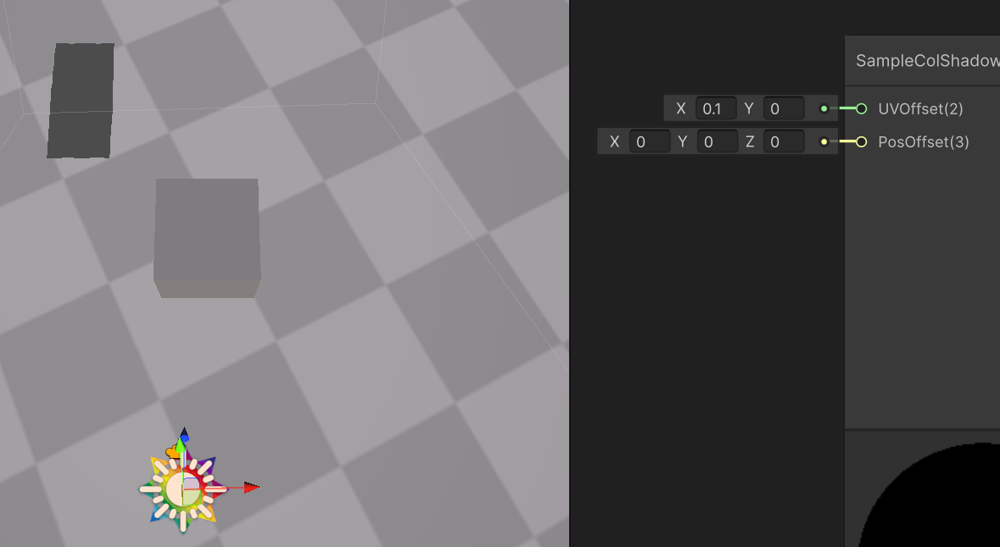

### Spawning particles on shadows

First make sure you have the Visual Effect Graph package installed. Enable the “Enable VFX Support” in the custom light component. This adds 2 passes which generate a buffer filled with the world positions of the shadow (this does create extra performance so turn it off if you are not using vfx.

>>>>>  gd2md-html alert: inline image link here (to images/image22.png). Store image on your image server and adjust path/filename/extension if necessary.  (<a href="#">Back to top</a>)(<a href="#gdcalert23">Next alert</a>) >>>>> 

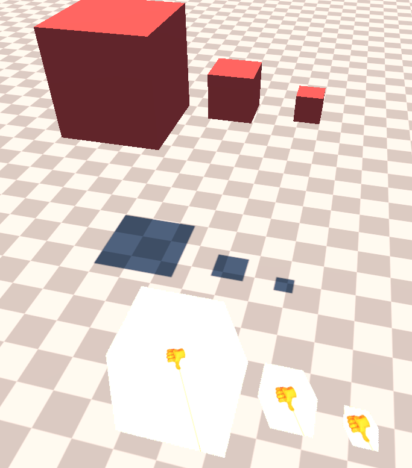

Add a new layer and add it to the object casting the shadow.

>>>>>  gd2md-html alert: inline image link here (to images/image23.png). Store image on your image server and adjust path/filename/extension if necessary.  (<a href="#">Back to top</a>)(<a href="#gdcalert24">Next alert</a>) >>>>> 

Then deselect that layer in the Shadow Receiving layermask.

>>>>>  gd2md-html alert: inline image link here (to images/image24.png). Store image on your image server and adjust path/filename/extension if necessary.  (<a href="#">Back to top</a>)(<a href="#gdcalert25">Next alert</a>) >>>>> 

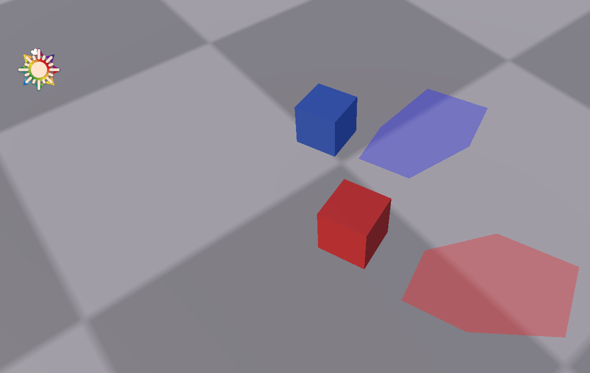

Create a VFX effect and create a “_Shadowpositions” graphics buffer and a “_ShadowPositionsCount” int.

>>>>>  gd2md-html alert: inline image link here (to images/image25.png). Store image on your image server and adjust path/filename/extension if necessary.  (<a href="#">Back to top</a>)(<a href="#gdcalert26">Next alert</a>) >>>>> 

Add the “Sample Shadow_Subgraph Operator” node and plug the _ShadowPositions and _ShadowPositionsCount variable into the node.

>>>>>  gd2md-html alert: inline image link here (to images/image26.png). Store image on your image server and adjust path/filename/extension if necessary.  (<a href="#">Back to top</a>)(<a href="#gdcalert27">Next alert</a>) >>>>> 

After setting up the VFX graph add it to the “Visual Effects” list in the custom light component so that the buffer and count get updated.

>>>>>  gd2md-html alert: inline image link here (to images/image27.png). Store image on your image server and adjust path/filename/extension if necessary.  (<a href="#">Back to top</a>)(<a href="#gdcalert28">Next alert</a>) >>>>> 

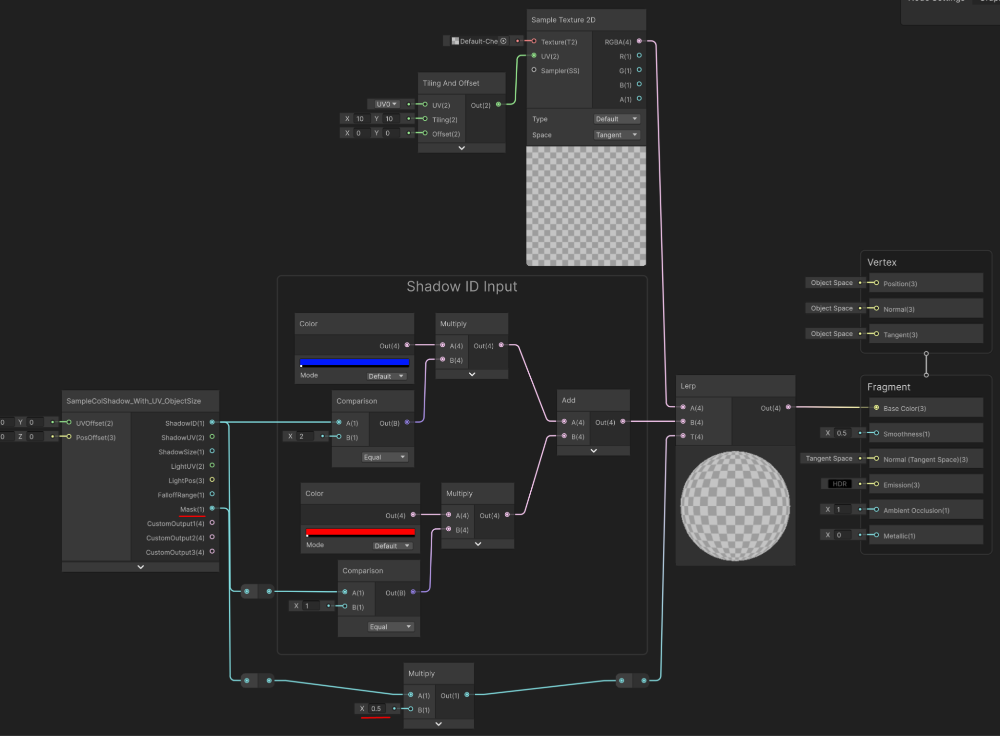

Here is a simple example to test if it’s working

>>>>>  gd2md-html alert: inline image link here (to images/image28.png). Store image on your image server and adjust path/filename/extension if necessary.  (<a href="#">Back to top</a>)(<a href="#gdcalert29">Next alert</a>) >>>>> 

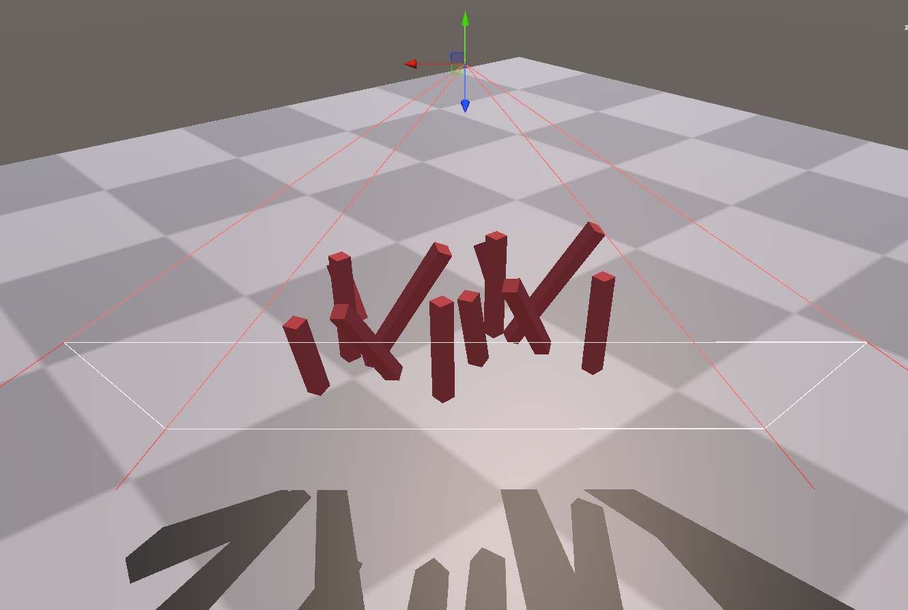

If you did everything correctly you should now have something similar to the image below.

>>>>>  gd2md-html alert: inline image link here (to images/image29.png). Store image on your image server and adjust path/filename/extension if necessary.  (<a href="#">Back to top</a>)(<a href="#gdcalert30">Next alert</a>) >>>>> 

## Custom Light

>>>>>  gd2md-html alert: inline image link here (to images/image30.png). Store image on your image server and adjust path/filename/extension if necessary.  (<a href="#">Back to top</a>)(<a href="#gdcalert31">Next alert</a>) >>>>> 

### **Light Index**

Dictates where it should write it’s data to for example if you want to access the shadow map directly you can input the _ColoredShadowMap(Light Index) as a Tex2D and read it’s values. The writing and managing is handled by the system and should not be changed by the user.

### **Light Mode**

Changes the type of light. A directional light casts each shadow as if it was really far away (for example our sun) so that each light ray is parallel to each other. A spot light casts the light like it was a flashlight. The light comes from a single point and spreads outwards. A point light casts light in all directions all around itself.

### Farplane

The near and far plane control what gets rendered. For example the far plane is set to 50 units and an object is further than 50 units away it wouldn’t cast a shadow.

On the left the object is inside farplane radius thus the shadow gets rendered. On the right it is outside the farplane radius so it doesn’t get rendered.

### **Size** 

This setting is accessed by setting the light mode to directional. It allows you to set the size of the area that light that it captures

The size on the left isn’t big enough to capture all of the shadows casting objects.

### FOV

This setting is accessed by setting the light mode to spot. It changes how spread out the light will be, a higher fov will cause it to cast light on a wider area, and a lower fov will make it narrower.

The fov on the left isn’t big enough to capture all of the shadows casting objects.

### Aspect Ratio

This setting is accessed by setting the light mode to spot. It allows you to change the aspect ratio for if you want to cast a more vertical or horizontal light.

### Radius

This setting is accessed by setting the light mode to point. It controls like the far plane up to what distance objects get rendered into the shadow map, but this time it’s an AABB cube the size of radius.

### Falloff Range

Sets the fall off range where shadows should fade out. 

### Add Shadow ID

This adds the value to the shadow id on the object casting the shadow. This lets you have the same object cast different shadows. In the setup below the object has a shadow id of 1 and one of the lights has an Add Shadow ID of 10 so in the shader the red shadow is linked to a shadow id of 1 and the blue shadow is linked to a shadow id of 11.

### Shadow Texture Size

the texture size of the shadow map in pixels. More pixels mean less jagged edges.

### Override Shader

The override shader used when capturing the shadow. This lets you change what information about the object gets stored in the shadow map.

### Shadow Casting Mask

Objects that can cast and receive shadows.

### Custom Values

These values get passed along to the shadows that this light casts. The maximum amount of custom values you can have is 12.

### Enable VFX Support

This enables 2 passes that add support for the vfx graph. This renders the scene again from the lights point of view so if you are not using the vfx graph this setting should be disabled.

### VFX Sampling Size

This controls how many points are sampled from the shadow map and how big the buffer should be. Changing this value recreates the buffer so it should not be changed often when the game is running. The size of the buffer is calculated by multiplying the value by itself, so with the input 256 the buffer size becomes 256 * 256 = 65536. This setting allows you to downsample the shadow map for particles since you usually don't need to sample every pixel. So if you set this value to 256 and your shadow map is 2048 then only every 8th pixel gets sampled, reducing the buffer size by 8 and doing 8 times less calculations. 

### VFX UV Size

Adjust the size of the uv correctly to control how big or small the sampled texture should be.

### VFX Relative UV Size

If you set a constant shadow size instead of the one given to you by the “Sample Colored Shadow” node you can get independently sized textures (top) instead of it being relative to the shadow size (bottom).

Indepent size

>>>>>  gd2md-html alert: inline image link here (to images/image31.png). Store image on your image server and adjust path/filename/extension if necessary.  (<a href="#">Back to top</a>)(<a href="#gdcalert32">Next alert</a>) >>>>> 

Relative size

>>>>>  gd2md-html alert: inline image link here (to images/image32.png). Store image on your image server and adjust path/filename/extension if necessary.  (<a href="#">Back to top</a>)(<a href="#gdcalert33">Next alert</a>) >>>>> 

### VFX Shadow Receiving Mask

Objects that should receive shadows. Objects that cast shadows should be excluded from this list as it would give incorrect results for the VFX world positions. This mask is only used for generating the VFX buffer.

### Visual Effects

This is a list of all the visual effects that you want to have access to the shadow map world positions. The Visual Effect Graph should have a graphics buffer called “*ShadowPositions” and an int called “*ShadowPositionsCount”.

## Sample Colored Shadow Node

>>>>>  gd2md-html alert: inline image link here (to images/image33.png). Store image on your image server and adjust path/filename/extension if necessary.  (<a href="#">Back to top</a>)(<a href="#gdcalert34">Next alert</a>) >>>>> 

### UV Offset

Float2 value that gets added to the shadow mapped uv before sampling the shadow map. If you are using point lights you should use position offset. Because the value gets added after getting the light space uv’s the offset you add is relative to the rotation of the light. So if you want to offset the shadow closer to the light, adding to the Y/V component of the uv offset ensures the shadow always goes closer to the light source (shown in the third image).

*No offset for reference*

*Adding 0.1 to the x of uv offset moves it perpendicular to the light direction.*

*Adding 0.1 to the y of the uv offset moves it closer to the light source.*

### Position Offset

Float3 that gets added to the world position before calculating the shadow mapped uv. Because this offset gets added to the world position before any calculations the offset is in world space and not relative like uv offset.

>>>>>  gd2md-html alert: inline image link here (to images/image34.png). Store image on your image server and adjust path/filename/extension if necessary.  (<a href="#">Back to top</a>)(<a href="#gdcalert35">Next alert</a>) >>>>> 

*No offset for reference*

>>>>>  gd2md-html alert: inline image link here (to images/image35.png). Store image on your image server and adjust path/filename/extension if necessary.  (<a href="#">Back to top</a>)(<a href="#gdcalert36">Next alert</a>) >>>>> 

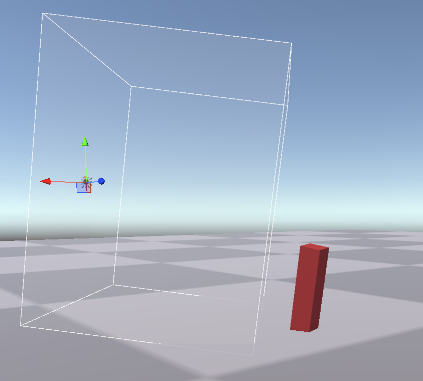

*X offset of 1 moves it diagonally upward relative to the light direction.*

### Shadow UV Size

Adjust the size of the uv correctly to control how big or small the sampled texture should be.

### Relative UV Size

If you set a constant shadow size instead of the one given to you by the “Sample Colored Shadow” node you can get independently sized textures (top) instead of it being relative to the shadow size (bottom).

Indepent size

>>>>>  gd2md-html alert: inline image link here (to images/image36.png). Store image on your image server and adjust path/filename/extension if necessary.  (<a href="#">Back to top</a>)(<a href="#gdcalert37">Next alert</a>) >>>>> 

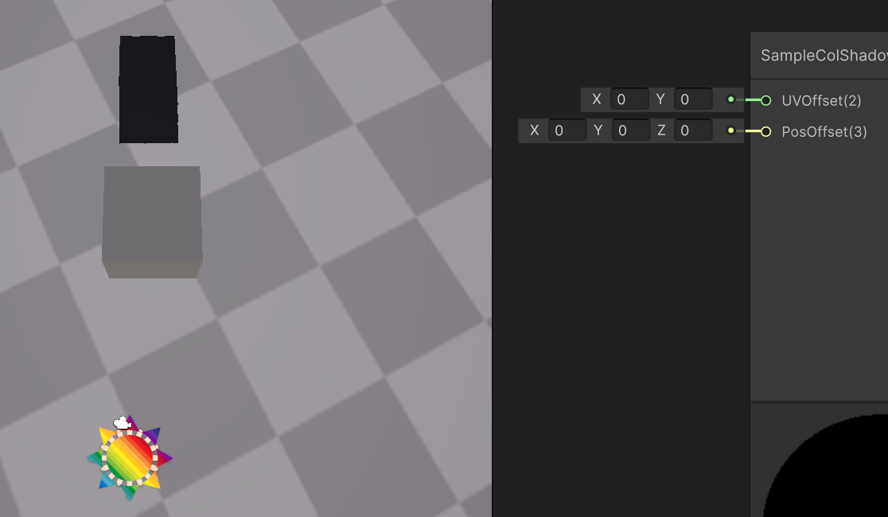

Relative size

>>>>>  gd2md-html alert: inline image link here (to images/image37.png). Store image on your image server and adjust path/filename/extension if necessary.  (<a href="#">Back to top</a>)(<a href="#gdcalert38">Next alert</a>) >>>>> 

### Shadow ID

The value set on the shadow casting object plus the “Add Shadow ID” value from the custom light.

**Shadow UV**

The origin of the shadow casting object converted to screen space. Essentially the uv coordinate of the origin on the shadow map. Used for mapping textures on a shadow.

### Shadow Size 

The distance between the min world bounds and the max world bounds of the shadow casting object. Used to keep textures mapped to a shadow to stay relative to the shadow size since it’s a rough estimate of the shadow size.

### Light UV

The uv coordinate used to sample the shadow map. Used for mapping textures on a shadow.

### Light Position

Position of the custom light that cast the shadow being sampled.

### Falloff Range

The distance relevant to the light position and the max falloff value. 1 being the light position and 0 being on the edge of the falloff range.

### Mask

Used to blend the shadows with the material.

### Custom Output 1/2/3

The custom output values from the lights custom values. The values are compacted into 3 float4 so the first value is in the customOutput R channel and the 7th custom value is in the second customOutput B channel.

## Limitations

You can’t have more than 10 custom lights in a scene (limit will be increased dramatically before release). Point lights can't have a texture size larger than 2730 because each face gets put next to each other so 2730 * 6 = 16380 and our limit is 16k textures which are 16384 maximum.